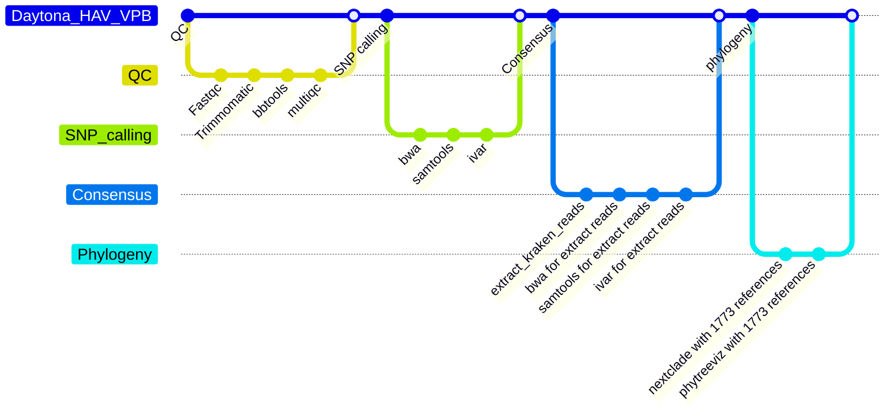

# Daytona_HAV_VPB

## Introduction
A pipeline for comprehensive sequence analyses of Hepatitis A Virus (HAV) based on VP1-P2B junction region. The pipeline can perform species detection, mutation identification, and genotyping based on phylogeny. Illumina paired-end sequencing data are required for the pipeline. 1773 VP1-P2B region sequences from all 7 HAV genotypes (IA, IB,IC, IIA, IIB, IIIA, IIIB) are used as reference to build the phylogeny of the test samples.
### Daytona_HAV vs Daytona_HAV_VPB
Daytona_HAV can be used to analyze any HAV sequencing data, while Daytona_HAV_VPB can only be used to analyze the data from VP1-P2B junction region sequencing.

## Prerequisites
Nextflow is needed. The details of installation can be found at https://github.com/nextflow-io/nextflow. For HiPerGator users, its installation is not needed. 

Singularity/APPTAINER is needed. The details of installation can be found at https://singularity-tutorial.github.io/01-installation/. For HiPerGator users, its installation is not needed.

SLURM is needed. For HiPerGator users, its installation is not needed.

Python3 is needed. The packages "pandas" and "biopython" should be installed by ``` pip3 install pandas/biopython ``` if not included in your python3.

The Kraken2 database PlusPF is needed. For HiPerGator users, downloading is not needed. It has been downloaded and configured in the pipeline.

Nextclade CLI is needed. The details of installation can be found at https://docs.nextstrain.org/projects/nextclade/en/stable/user/nextclade-cli/installation/index.html .  For HiPerGator users, the installation is not needed.

## Workflow



## Recommended conda environment installation
   ```bash
   conda create -n HAV -c conda-forge python=3.10
   ```
   ```bash
   conda activate HAV
   ```


## How to run

1. Put your data files into the directory /fastqs/hav/. Your data file's name should look like "XZA22002292_1.fastq.gz", "XZA22002292_2.fastq.gz". You may use the script <mark>***rename.sh***</mark> to rename your data files.

<mark>Note:  ***Do not place fastq data in any location other than the fastq/hav/ directory within the Daytona_HAV pipeline folder. Placing data in other locations will cause program errors.***</mark>        
                      
2. Open the file "params_hcv.yaml", and set the parameters absolute paths. They should be ".../.../fastqs/hav", ".../.../output", etc.
                      
3. Get into the top directory of the pipeline and then run the following command.              
```bash
sbatch Daytona_HAV_VPB_NXC.sh   # generate phylogenetic tree
```       
## Main output
### 1. HAV reads detection      
|sampleID|species/tax_ID/percent(%)/number|...|        
|:---|:---|:---|             
|xxx25002686_S1|Hepatitis A/12092/93.58/123349|...|       
                                              
The second column of the above table indicates that 123349 reads 93.58%) in the sample (xxx25002686_S1) are identified as HAV species.           
### 2. Variants    
|REGION|POS|REF|ALT|...|PVAL|PASS|...|        
|:---|:---|:---|:---|:---|:---|:---|:---|             
|NC_001489.1|2895|T|G|...|0.526316|FALSE|...|
|NC_001489.1|2927|T|C|...|0|TRUE|...|                   

Note: PASS is the result of p-value <= 0.05. If a SNP's PASS value is FALSE, it fails to pass the quality check.      

### 3. Genotype and mutations
The outputfile named as genotype_mutation.csv shows the HAV subtype and VP1-P2B mutaiton information of each test sample. These information is generated based on alignment and phylogeny of the test samples and the 1773 HAV subtype references. For example, the "clade" column represents the subtype of each test sample in the table below.  


### 4. Phylogeny

The phylogenetic tree of the test samples and 1773 HAV subtype references are generated in Auspice JSON v2 format and Newick format. For vivid visual effects and interaction with the tree diagram (see below), you may visualize the tree files online in auspice.us (https://auspice.us/). Also, two tree diagrams in SVG and PDF formats are generated for convenience.


   


## Test data
Test data can be found in /blue/bphl-florida/share/Daytona_HAV_test_sample. To use them, please copy them to the directory .../fastqs/hav/.    
Also, the results of these test data can be found in in /blue/bphl-florida/share/Daytona_HAV_test_sample/output-20251009215948.

## Contact
If you want to report bugs, suggest enhancements, discuss ideas related to the project, please use the repository's "Issues" tab in GitHub.

## Note      
If you want to get email notification when the pipeline running ends, please input your email address in the line "#SBATCH --mail-user=<EMAIL>" of Daytona_HAV.sh.  
