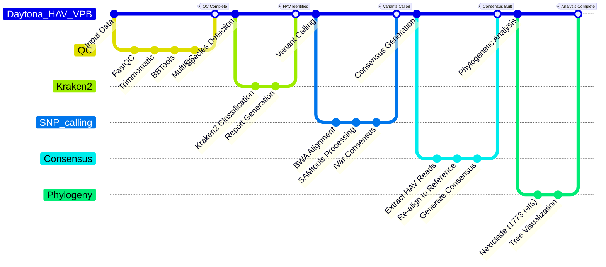

# 🧬 Daytona_HAV_VPB

<div align="center">


**A comprehensive bioinformatics pipeline for Hepatitis A Virus (HAV) sequence analysis**  
*Specializing in VP1-P2B junction region analysis*

[Features](#-key-features) • [Installation](#-installation) • [Usage](#-usage) • [Outputs](#-output-files) • [Support](#-support)

</div>

---

## 📋 Table of Contents

- [Overview](#-overview)
- [Key Features](#-key-features)
- [Prerequisites](#-prerequisites)
- [Installation](#-installation)
- [Pipeline Workflow](#-pipeline-workflow)
- [Usage](#-usage)
- [Output Files](#-output-files)
- [Test Data](#-test-data)
- [Troubleshooting](#-troubleshooting)
- [Contributing](#-contributing)
- [Contact](#-contact)
- [Citation](#-citation)

---

## 🔬 Overview

**Daytona_HAV_VPB** is a specialized bioinformatics pipeline designed for comprehensive sequence analysis of Hepatitis A Virus (HAV), focusing on the VP1-P2B junction region. The pipeline integrates multiple analytical tools to provide:

- 🧪 **Species Detection** - Accurate identification of HAV reads
- 🧬 **Mutation Analysis** - Comprehensive variant calling and characterization
- 🌳 **Genotyping** - Phylogenetic classification across all 7 HAV genotypes (IA, IB, IC, IIA, IIB, IIIA, IIIB)
- 📊 **Quality Control** - Integrated QC reporting with MultiQC

### Daytona_HAV vs Daytona_HAV_VPB

| Feature | Daytona_HAV | Daytona_HAV_VPB |
|---------|-------------|-----------------|
| **Data Type** | Any HAV sequencing data | VP1-P2B junction region only |
| **Use Case** | General HAV analysis | Targeted VP1-P2B analysis |
| **References** | Variable | 1,773 curated VP1-P2B sequences |

> ⚠️ **Important**: This pipeline requires Illumina paired-end sequencing data and is optimized for VP1-P2B region analysis.

---

## ✨ Key Features

### 🎯 Core Capabilities

- **Automated QC Pipeline**: FastQC, Trimmomatic, BBTools, and MultiQC integration
- **Kraken2-based Species Detection**: Utilizes PlusPF database for accurate HAV identification
- **High-Resolution Variant Calling**: BWA + SAMtools + iVar workflow for SNP detection
- **Comprehensive Phylogenetic Analysis**: Integration with Nextclade using 1,773 reference sequences
- **Interactive Visualization**: Auspice-compatible outputs for dynamic tree exploration
- **Production-Ready**: Designed for SLURM-based HPC environments (HiPerGator optimized)

### 📦 Reference Database

The pipeline includes a curated reference dataset of **1,773 VP1-P2B sequences** spanning all 7 HAV genotypes:
- Genotype IA, IB, IC
- Genotype IIA, IIB
- Genotype IIIA, IIIB

---

## 🔧 Prerequisites

### Required Software

| Tool | Purpose | Installation |
|------|---------|-------------|
| **Nextflow** | Workflow manager | [Installation Guide](https://github.com/nextflow-io/nextflow) |
| **Singularity/Apptainer** | Container runtime | [Installation Guide](https://singularity-tutorial.github.io/01-installation/) |
| **SLURM** | Job scheduler | System-dependent |
| **Python 3.10+** | Scripting | System package manager |

### Python Dependencies

```bash
pip3 install pandas biopython
```

### Database Requirements

- **Kraken2 PlusPF Database** (pre-configured for HiPerGator users)

> 💡 **HiPerGator Users**: All prerequisites are pre-installed. No additional setup required!

---

## 📥 Installation

### 1. Clone the Repository

```bash
git clone https://github.com/BPHL-Molecular/Daytona_HAV_VPB.git
cd Daytona_HAV_VPB
```

### 2. Set Up Conda Environment (Recommended)

```bash
# Create dedicated environment
conda create -n HAV_VPB -c conda-forge python=3.10

# Activate environment
conda activate HAV_VPB

# Install dependencies
pip install pandas biopython
```

### 3. Verify Installation

```bash
# Check Nextflow
nextflow -version

# Check Singularity
singularity --version

# Check Python packages
python -c "import pandas, Bio; print('Dependencies OK')"
```

---

## 🔄 Pipeline Workflow


```mermaid
%%{ init: { 'gitGraph': { 'mainBranchName': 'Daytona_HAV_VPB' } } }%%
%%{init: { 'themeVariables': { 'commitLabelFontSize': '20px', 'fontSize': '24px' } } }%%
gitGraph
    commit id: "Input Data"
    
    branch QC
    checkout QC
    commit id: "FastQC"
    commit id: "Trimmomatic"
    commit id: "BBTools"
    commit id: "MultiQC"
    checkout Daytona_HAV_VPB
    merge QC tag: "QC Complete"

    commit id: "Species Detection"
    branch Kraken2
    checkout Kraken2
    commit id: "Kraken2 Classification"
    commit id: "Report Generation"
    checkout Daytona_HAV_VPB
    merge Kraken2 tag: "HAV Identified"
    
    commit id: "Variant Calling"
    branch SNP_calling
    checkout SNP_calling
    commit id: "BWA Alignment"
    commit id: "SAMtools Processing"
    commit id: "iVar Consensus"
    checkout Daytona_HAV_VPB
    merge SNP_calling tag: "Variants Called"
    
    commit id: "Consensus Generation"
    branch Consensus
    checkout Consensus
    commit id: "Extract HAV Reads"
    commit id: "Re-align to Reference"
    commit id: "Generate Consensus"
    checkout Daytona_HAV_VPB
    merge Consensus tag: "Consensus Built"

    commit id: "Phylogenetic Analysis"
    branch Phylogeny
    checkout Phylogeny
    commit id: "Nextclade (1773 refs)"
    commit id: "Tree Visualization"
    checkout Daytona_HAV_VPB
    merge Phylogeny tag: "Analysis Complete"
```

### Workflow Steps

1. **Quality Control**: Trim adapters, filter low-quality reads, generate QC reports
2. **Species Detection**: Identify HAV reads using Kraken2
3. **Variant Calling**: Align to reference, call SNPs, generate variant reports
4. **Consensus Building**: Extract HAV-specific reads, build consensus sequences
5. **Phylogenetic Analysis**: Genotype assignment, mutation detection, tree generation

---

## 🚀 Usage

### Step 1: Prepare Input Data

**CRITICAL**: Place your FASTQ files in the correct directory:

```bash
# File location (required)
fastqs/hav/

# Naming convention
SampleID_1.fastq.gz  # Forward reads
SampleID_2.fastq.gz  # Reverse reads

# Example
XZA22002292_1.fastq.gz
XZA22002292_2.fastq.gz
```

> 📁 **Important**: Files MUST be in `fastqs/hav/` - other locations will cause errors!

**Need to rename files?** Use the provided rename script:

```bash
./rename.sh
```

### Step 2: Configure Parameters

Edit `params_hav.yaml` with absolute paths:

```yaml
# Input/Output directories (use absolute paths)
input_dir: "/path/to/your/fastqs/hav"
output_dir: "/path/to/your/output"
reference_dir: "/path/to/reference"

# Analysis parameters
min_depth: 10
min_quality: 20
threads: 8
```

### Step 3: Run the Pipeline

```bash
# Submit to SLURM scheduler
sbatch Daytona_HAV_VPB_NXC.sh
```

### Step 4: Monitor Progress

```bash
# Check job status
squeue -u $USER

# View log file
tail -f slurm-<jobid>.out

# Check output directory
ls -lh output/
```

---

## 📊 Output Files

### 1. 🧬 HAV Reads Detection

**File**: `output/sum_report.txt`

| Column | Description | Example |
|--------|-------------|---------|
| `sampleID` | Sample identifier | xxx25002686_S1 |
| `species/tax_ID/percent(%)/number` | Classification results | Hepatitis A/12092/93.58/123349 |

**Interpretation**: In the example above, 123,349 reads (93.58%) were identified as HAV in sample xxx25002686_S1.

### 2. 🔍 Variant Analysis

**File**: `output/variants/*.tsv`

| Column | Description | Quality Check |
|--------|-------------|--------------|
| `REGION` | Reference genome | NC_001489.1 |
| `POS` | Position | 2895 |
| `REF` | Reference base | T |
| `ALT` | Alternate base | G |
| `PVAL` | P-value | 0.526316 |
| `PASS` | QC status | FALSE (p > 0.05) |

> ✅ **Pass Criteria**: Variants with `PASS = TRUE` have p-value ≤ 0.05

### 3. 🧪 Genotype & Mutations

**File**: `output/nextclade/genotype_mutation.csv`

<div align="center">


</div>

**Key Columns**:
- `clade`: HAV subtype (IA, IB, IC, IIA, IIB, IIIA, IIIB)
- `substitutions`: Nucleotide changes
- `aaSubstitutions`: Amino acid changes
- `qc.overallStatus`: Quality assessment

### 4. 🌳 Phylogenetic Trees

**Output Formats**:

| Format | File | Use Case |
|--------|------|----------|
| Newick | `nextclade.nwk` | Standard phylogenetic software |
| Auspice JSON v2 | `nextclade.json` | Interactive visualization at [auspice.us](https://auspice.us/) |
| SVG | `tree_with_reference.svg` | High-resolution image |
| PDF | `tree_with_reference.pdf` | Publication-ready |

#### Visualization Examples

**Figure 1: Complete Tree (Test Samples + References)**

<div align="center">


*1,773 reference sequences with test samples highlighted*

</div>

**Figure 2: Test Samples Only**

<div align="center">


*Focused view of your analyzed samples*

</div>

### 5. 📁 Complete Output Structure

```
output/
├── qc/
│   ├── fastqc/           # FastQC reports
│   └── multiqc/          # Aggregated QC report
├── kraken_out/           # Species classification
├── variants/             # SNP calling results
├── extract/              # Consensus sequences
│   ├── *_consensus.fa    # Individual consensus
│   └── sum_consensus.fa  # Combined consensus
├── nextclade/            # Phylogenetic analysis
│   ├── nextclade.tsv     # Genotype table
│   ├── nextclade.nwk     # Newick tree
│   ├── nextclade.json    # Auspice JSON
│   └── genotype_mutation.csv
├── tree_with_reference.svg
├── tree_with_reference.pdf
└── logs/                 # Pipeline logs
```

---

## 🧪 Test Data

### For HiPerGator Users

Pre-validated test datasets are available:

```bash
# Location of test data
/blue/bphl-florida/share/Daytona_HAV_test_sample

# Copy to your working directory
cp /blue/bphl-florida/share/Daytona_HAV_test_sample/* /path/to/your/fastqs/hav/

# Run pipeline
sbatch Daytona_HAV_VPB_NXC.sh
```

**Expected Results**:
- Runtime: ~30-45 minutes (depending on data size)
- Output: Complete phylogenetic tree with genotype assignments
- Quality: All samples should pass QC metrics

---

## 🔧 Troubleshooting

### Common Issues

<details>
<summary><b>❌ Error: Files not found in fastqs/hav/</b></summary>

**Solution**: Verify file location and naming

```bash
# Check files exist
ls -l fastqs/hav/

# Verify naming pattern
# Correct: SampleID_1.fastq.gz, SampleID_2.fastq.gz
# Incorrect: SampleID.R1.fastq.gz
```
</details>

<details>
<summary><b>❌ Error: No Hepatovirus A detected</b></summary>

**Possible Causes**:
- Insufficient sequencing depth
- Wrong reference database
- Contamination

**Solution**:
1. Check MultiQC report for read quality
2. Verify Kraken2 database configuration
3. Inspect raw FASTQ files
</details>

<details>
<summary><b>❌ Error: Nextclade analysis failed</b></summary>

**Solution**: Check consensus quality

```bash
# Verify consensus sequences exist
ls output/extract/*_consensus.fa

# Check sequence length
grep -v ">" output/extract/sum_consensus.fa | wc -c
```
</details>

<details>
<summary><b>⚠️ Warning: Low PASS rate in variants</b></summary>

**Interpretation**: Many variants failing p-value threshold

**Solution**:
- Increase sequencing depth
- Adjust quality filtering parameters
- Review alignment quality metrics
</details>

### Getting Help

1. **Check logs**: Review `slurm-*.out` for error messages
2. **Validate inputs**: Ensure FASTQ files are properly formatted
3. **Resource issues**: Verify adequate disk space and memory
4. **Contact support**: Open an issue on GitHub

---

## 🔔 Email Notifications

To receive email updates when your pipeline completes:

1. Edit `Daytona_HAV_VPB_NXC.sh`
2. Update the mail-user line:

```bash
#SBATCH --mail-user=your.email@example.com
#SBATCH --mail-type=END,FAIL
```

---

## 🤝 Contributing

We welcome contributions! Here's how you can help:

### Reporting Issues

1. Visit our [Issues page](https://github.com/BPHL-Molecular/Daytona_HAV_VPB/issues)
2. Check if your issue already exists
3. Create a new issue with:
   - Clear description
   - Steps to reproduce
   - Expected vs actual behavior
   - System information

### Suggesting Enhancements

- Open an issue with the `enhancement` label
- Describe the feature and its benefits
- Provide use cases if applicable

### Pull Requests

1. Fork the repository
2. Create a feature branch
3. Make your changes
4. Submit a pull request with clear description

---

## 📧 Contact

### Support Channels

| Channel | Purpose | Response Time |
|---------|---------|---------------|
| **GitHub Issues** | Bug reports, feature requests | 1-3 business days |
| **Email** | General inquiries | 2-5 business days |
| **Documentation** | Self-service help | Immediate |

### Project Team

**Bureau of Public Health Laboratories - Molecular Biology Division**
- Organization: BPHL-Molecular
- Repository: [Daytona_HAV_VPB](https://github.com/BPHL-Molecular/Daytona_HAV_VPB)

---

## 📚 Citation

If you use this pipeline in your research, please cite:

```bibtex
@software{daytona_hav_vpb,
  title = {Daytona HAV VPB: A Comprehensive Pipeline for Hepatitis A Virus VP1-P2B Analysis},
  author = {BPHL Molecular Biology Division},
  year = {2025},
  url = {https://github.com/BPHL-Molecular/Daytona_HAV_VPB}
}
```

---

## 📜 License

This project is licensed under the MIT License - see the [LICENSE](LICENSE) file for details.

---


<div align="center">

**[⬆ Back to Top](#-daytona_hav_vpb)**


</div>
